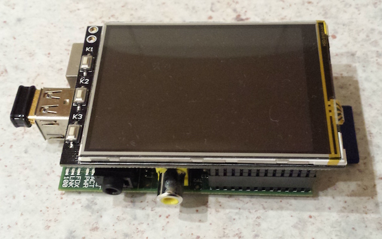
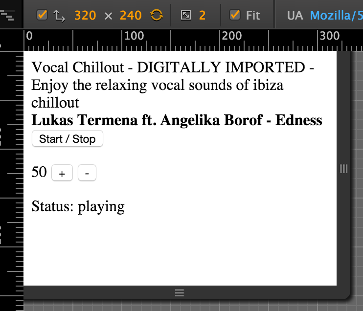

# P3 - PiPlayProject

The P3 aims to provide a simple audio player appliance created with a Raspberry Pi and a little bit of Javascript using the Meteor stack (www.meteor.com).

## The prototype

The prototype consists of a Raspberry Pi B, a Nano WiFi dongle and a 3.2" LCD touch panel (specifics will follow) running a raspbian image.

## The player

The user interface for the audio player is created with pure HTML, CSS and Javascript and displayed within a Chromium window in fullscreen App mode usind Matchbox window-manager.
Currently the UI shows only the web radio station, the current song info and a start/stop button.

The audio stream is played ON THE RASPBERRY itself, not in within the Chromium instance, so you can remote-control the player from any browser.

## Why

This project shall replace my Sagem RM50 player in the kitchen! One needs challenges! :)

